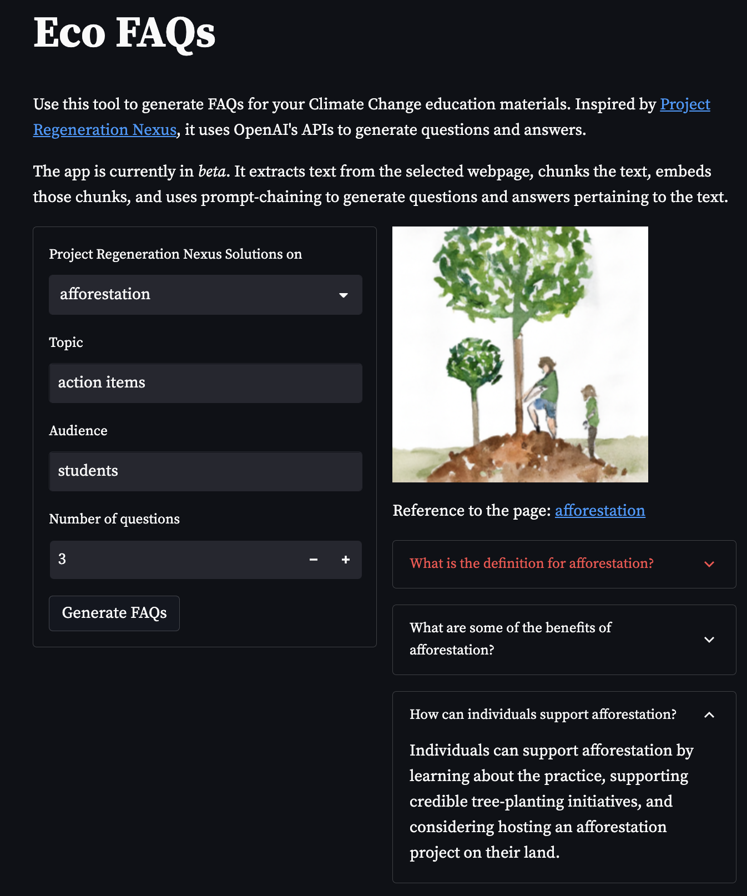
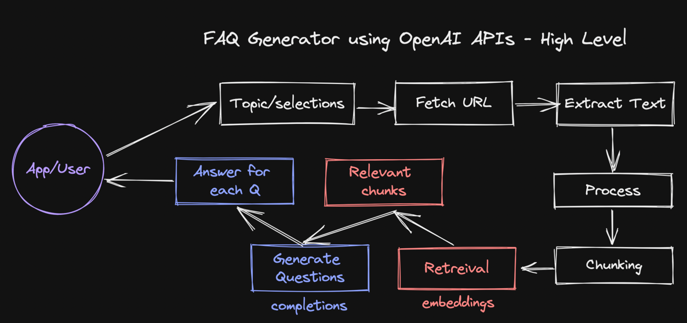

# Eco FAQs

This proof of concept application generates frequently asked questions (FAQs) for classroom climate change education, 
based on information from the [Project Regeneration Nexus](https://regeneration.org/nexus) website. 
Users can select from a range of topics (e.g. agroecology, biochar, electric vehicles), 
specify a target audience, and choose the number of questions they would like to generate. 
The app then extracts text from the selected webpage, uses OpenAI's APIs to generate questions and answers, and displays the results.

[Usage Guidelines](https://beta.openai.com/docs/usage-policies) | [Terms of Use](https://openai.com/api/policies/terms/)

### How does it work? 

* Uses trafilatura to extract text from the selected nexus page
* Chunks the text and uses [OpenAI's embeddings API](https://beta.openai.com/docs/guides/embeddings/what-are-embeddings)
to generate document embeddings for each chunk
* Uses query embeddings to find the most similar documents related to the selected topic
* Uses [OpenAI's completion API](https://beta.openai.com/docs/api-reference/completions/create-completion) to 
generate relevant questions pertaining to the corpus of text
* Uses the completion API to generate answers, given relevant information, for the generated questions
* Generates a relevant image using [DALL-E API](https://beta.openai.com/docs/guides/images) to illustrate the FAQ

### Architecture

### Getting started 

To run this app locally, follow the steps:

1. Clone the repository (`gh repo clone shyamal-anadkat/eco-faqs`)
2. Create a virtual environment (`python3 -m venv venv && source venv/bin/activate`)
2. Install the requirements by running `make install`
3. Ensure your OpenAI API key is set as an environment variable `OPENAI_API_KEY` 
(see best practices around API key safety [here](https://help.openai.com/en/articles/5112595-best-practices-for-api-key-safety))
4. Run the [streamlit](https://streamlit.io/) app by running `make run`
5. Open the app in your browser at `http://localhost:8501`
6. (_for contributing_) To run the formatter, run `make format`

## Documentation and Additional Resources

OpenAI API documentation can be found [here](https://beta.openai.com/docs/introduction).

Inspired by [Project Regeneration](https://regeneration.org/nexus)

### Additional tips for the hackathon and for the curious

#### Building your first prototype

For those new to the OpenAI API, our [playground](https://beta.openai.com/playground) can be a great resource for 
exploring its capabilities. If you haven’t gone through the [quickstart guide](https://beta.openai.com/docs/quickstart) 
here, we recommend you start there. Here you can test different prompts, play with different parameters, 
and experiment with different data sets. Doing so will help you learn what's possible and where 
you may want to focus your efforts. You can explore what’s possible by checking out some example prompts 
we put together [here](https://beta.openai.com/examples). 

While the playground is a great place to prototype, it can also be used as an incubation area for larger projects. 
You can iterate on your concepts and scale your application, eventually building out a production-ready environment. 
The playground also makes it easy to export API details, and share prompts with collaborators, 
making it an integral part of your development process.

##### Parameters 

Generally, we find that Model and Temperature are the most commonly used parameters to alter the model output. 
 
* **Model** - Higher performance models are more expensive and have higher latency.
* **Temperature** - A measure of how often the model outputs a less likely token. The higher the temperature, the more random (and usually creative) the output. This, however, is not the same as truthfulness. For most factual use cases such as data extraction, and truthful Q&A, the temperature of 0 is best.
* **Maximum length** - Does not control the length of the output, but a hard cutoff limit for token generation. Ideally, you won’t hit this limit often, as your model will stop either when it thinks it’s finished, or when it hits a stop sequence you defined.
* **Stop sequences** - A set of characters that, when generated, will cause the text generation to stop.

##### Fine-tuning a classifier to improve truthfulness 

You can fine-tune a classifier to perform the same discriminative function as a human expert - to effectively 
select the best out of the number of generated samples. Best may range from domain to domain, but usually, truthfulness 
is the main constraint on being able to "productionize" a prototype.

In the example [here: fine-tuning a classifier to improve truthfulness](https://help.openai.com/en/articles/5528730-fine-tuning-a-classifier-to-improve-truthfulness), we demonstrate this concept by generating an 
advertisement. We want the ad to be truthful and supported by the context we provide. 
To that effect, we fine-tune a binary classifier to rate the truthfulness of each completion, 
based on a few hundred to a thousand labeled examples, predicting “yes” or “no”. 
You could train multiple discriminators in this way, depending on what you’re trying to achieve, 
and combine their outputs in interesting ways.

##### Guidance on when to use few-shot prompting versus when to fine-tune

* **Zero shot** is the first default approach to try. This means writing clear and detailed instructions, including the format specification.
* **Few-shot** is good if zero-shot fails, or if it’s easier to specify the exact format that way. To do a few-shot, you need to only create a few examples.
* **Fine-tuning** should be better if you have a lot of examples. While few-shot prompting can be a decent option if you're 
limited in terms of data or time, we would generally recommend fine-tuning a model whenever possible. 
The main reason for this is that fine-tuning will ultimately be more efficient and cost-effective: 
with few-shot prompting, you need to include examples in every API call, which leads to more tokens and higher costs. 
A caveat to this is that we currently only offer fine-tuning of the newer series models. 

---

